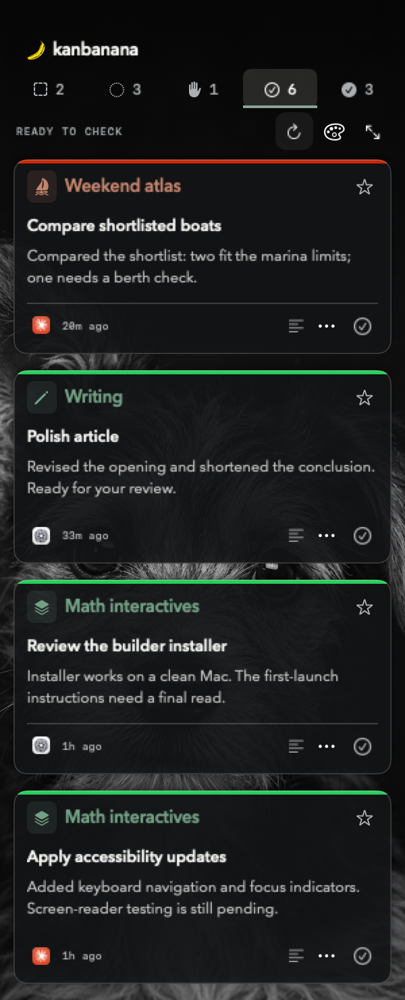
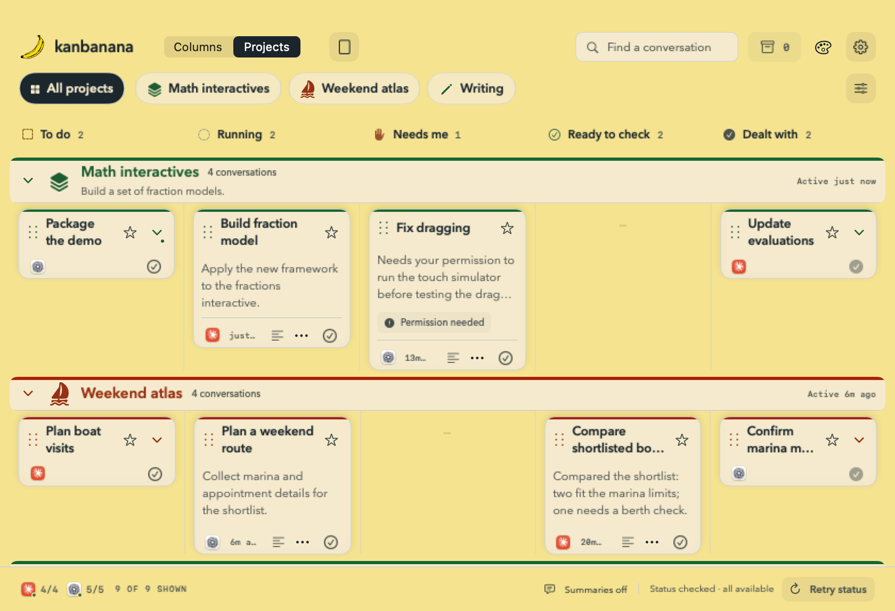

<p align="center"></p>

# kanbanana

**A little Mac window for keeping up with your AI agents.**

See what's running in Claude Code and Codex, remember what you asked, and jump into the right conversation. One card per conversation. Projects, priorities and notes help you pick up where you left off.



**0.3.0 beta · Apple Silicon · source release.** Built for Claude Desktop's **Code** section and Codex Desktop local sessions. Independently developed; not affiliated with Anthropic or OpenAI.

## Get started

This beta is distributed as source. **No paid Apple Developer membership or signing certificate is needed to build and run it locally.** The build uses ad-hoc signing. A future signed, notarized download would be a separate convenience; this release has no binary download.

Requirements: Apple Silicon Mac, macOS 14 or later, Xcode command line tools with Swift 6.0 or newer (Xcode 16+), and at least one supported desktop app. See [tested compatibility and limitations](docs/COMPATIBILITY.md). The minimum OS is a build target, not a claim that every older version has been tested.

```zsh
git clone https://github.com/laurenceholt/kanbanana.git
cd kanbanana
zsh scripts/build.zsh
open dist/kanbanana.app
```

The build downloads a pinned, checksum-verified Python runtime and bundles it in the app. Python does not need to be installed separately to run the resulting bundle. Keep the whole `.app` together; you can move it to Applications.

You can also give your coding agent this instruction:

> Clone https://github.com/laurenceholt/kanbanana, read README.md, check the macOS/Swift requirements, run the tests and `zsh scripts/build.zsh`, then open `dist/kanbanana.app`. Do not change provider permissions or read my API key.

On first launch, choose which providers to monitor. Local conversations active in the last two weeks are discovered automatically. Cloud summaries are **off by default**; the board works with request/report excerpts and no API key.

Click the banana and counts in the menu bar to reopen the window. Closing the window leaves monitoring running. Settings → Quit ends it. Double-click the app to restart.

## Three views, one board

- **Focus:** a narrow strip beside your other windows. Ready to check is the default list. Click a status icon to switch lists.
- **Projects:** horizontal lanes, grouped by project. Priority projects come first, then recent activity.
- **Columns:** a compact board mixing projects within each status. Optionally fold projects into stacks.



| State | Meaning |
| --- | --- |
| To do | You reviewed the previous round and want to return later. Manual only; an optional card note records what comes next. |
| Running | Recent execution evidence, including tracked background tasks. |
| Needs me | A detected question, required approval, error or interruption. Some native permission waits are not observable. |
| Ready to check | The agent appears to have delivered. This does not certify the work. |
| Dealt with | Your manual acknowledgement. A new request reactivates the card. |

Click a title to open its native conversation; expand history to see earlier requests. Star any card to keep it near the top. Project assignments and notes belong to kanbanana and never change the source app.

Quiet cards are parked after seven days; To do reminders stay. Use the archive-box button in the full board to find and restore parked cards. Focus's expand arrows open Projects.

## Optional summaries

Settings → save an OpenAI API key → explicitly enable summaries. Saving a key alone does not enable them. Selected requests and latest agent reports are sent directly to OpenAI and billed to your API account. A ChatGPT subscription is separate.

Choose the model, exclude sensitive projects, and set a daily limit (100 summary attempts by default). Each attempt can make up to two calls; this is **not a dollar budget**. Ready to check and Needs me cards summarize what the agent reported; other states summarize your latest ask. Request history stays focused on your asks. Both types are summarized automatically. Summarizing older history requires a button; cached summaries may be refreshed when the wording format changes.

Keys stay in macOS Keychain. Delete saved key stops summaries and removes the stored credential. [Privacy and retention details](PRIVACY.md).

## Your data

The board is local, in `~/Library/Application Support/Agent Kanban/`. `board.json` holds your notes, projects, settings and manual choices; `observations.json` is a rebuildable history cache; `summary-usage.json` records daily attempts. The historical folder name preserves existing installations. Seven rotating backups are stored alongside them. Existing boards migrate automatically after a backup.

Settings provides **Export board**, **Restore**, **Open data folder**, and **Diagnostics**. Board exports include private request text; diagnostic reports include only versions, health categories and aggregate counts. [Backup, recovery and troubleshooting](docs/TROUBLESHOOTING.md).

## Appearance

Classic colors, Night, Brutalist and Photos. Photos includes 18 local backgrounds with a picker and hourly rotation; it makes no background network requests. [Photo credits](Resources/Photos/README.md) · [Asset and runtime notices](THIRD_PARTY_NOTICES.md).

## Development

```zsh
swift test
zsh scripts/fetch-runtime.zsh
.build/runtime/python/bin/python3 -I -B -m unittest discover -s tests -v
zsh scripts/build.zsh
```

Try the interface without connecting to any personal data:

```zsh
swift run AgentKanban --demo
```

Demo mode uses fictional conversations, temporary storage/preferences, and disabled provider/Keychain/network services. Changes are discarded when you quit. See [Architecture](docs/ARCHITECTURE.md) for module boundaries and the synthetic reader benchmark.

[Contributing](CONTRIBUTING.md) · [Architecture](docs/ARCHITECTURE.md) · [Release process](docs/RELEASING.md) · [Changelog](CHANGELOG.md) · [Report a security issue](SECURITY.md).

The code and generated banana mark are MIT licensed. Sourced photos and bundled runtime components retain their separate notices.
