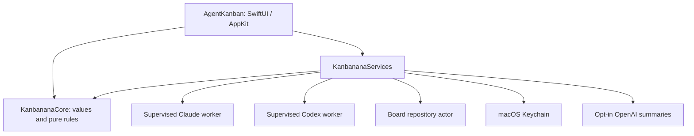

# Architecture

kanbanana is a local macOS app with three SwiftPM targets and one read-only Python package. Swift 6 language mode checks concurrency boundaries. There is no backend, account system, event bus or plugin framework.

## Ownership and dependency direction

| Target | Responsibility | Dependencies |
| --- | --- | --- |
| `KanbananaCore` | Source observations, manual dispositions, projects, request ordering, commands, lifecycle and reconciliation | Foundation only |
| `KanbananaServices` | Process supervision, IPC decoding, repository, credentials, summary scheduling and HTTP | Core; macOS platform frameworks |
| `AgentKanban` | Composition, published presentation state, windows, navigation and views | Core and Services |

Cross-target types use package access. Core cannot import either outer target. The app's `BoardStore` is a main-actor coordinator with read-only published saved state; views issue commands instead of editing the graph. Provider observations pass through `BoardReconciler`. Manual commands operate on the coordinator's current revision, rather than a potentially stale card captured by a view. Settings and integration controls are explicit coordinator methods.

`BoardView`, `ConversationCard`, `HistoryView`, `ProjectsView` and `SettingsView` own their respective surfaces. `FocusView`, `ProjectLanes` and `ProjectStacks` project the same state. Photo decoding/caching is main-actor owned; preview resource locations are injected through the environment. Card equality compares a Sendable presentation value without reading an actor-isolated store.

## Observations are not user decisions

A conversation has source evidence: provider identity, execution state, event identity/time and recent requests. A separate disposition holds project assignment, priority, To do reminder, acknowledgement and parking. A board column is a pure projection of both.

An agent cannot put a card in To do or Dealt with. A new request supersedes an old acknowledgement. A To do reminder follows its request rather than every later execution event. Provider outages preserve the last evidence and all curation, while showing that observation is unavailable. A successful read of a quiet log does not prove execution is still alive; parser activity limits remain separate from transport freshness.

## Reader supervision and protocol

`ReaderSupervisor` owns one independently supervised worker per enabled provider. Each newline-delimited JSON frame has `protocolVersion: 1`, provider, typed health, changed cards, known IDs, scan time and inventory completeness. `ReaderProtocol.swift` defines transport DTOs separately from stored records and manual UI states. Unknown protocol versions, invalid identities/states, malformed frames and truncated EOF fail explicitly.

The shared contract fixture is `tests/KanbananaServicesTests/Fixtures/provider-frame-v1.json`. Python tests compare encoder output with it; Swift tests decode it, reconcile, persist and reload it.

- Workers poll every 4 seconds with running cards, otherwise every 10 seconds. An unchanged scan sends an inventory heartbeat without request bodies.
- A continuous 20-second freshness deadline applies after every successful frame, including the first. Stalls become visibly stale and trigger reconnection.
- Retry and configuration changes cancel the previous generation and await worker termination before replacements start. Shutdown also waits for termination and pending storage.
- A dedicated dispatch queue reads each pipe. Swift's UI and cooperative executor never block on pipe reads. Stop sends TERM and escalates to KILL after 0.5 seconds, then reaps the child.
- Frames are limited to 8 MiB, and the pipe stream buffers at most 32 chunks. Overflow stops the worker rather than allowing unchecked buffering.
- Failures back off from 2 to 30 seconds. One failing provider cannot suppress the other's updates.
- Only a complete inventory establishes absence. Unreadable Claude metadata marks an inventory partial; unreadable transcripts identify the affected card. Error categories omit private paths and text.

The narrow `ProcessReaderConnection` Foundation bridge has a documented `@unchecked Sendable` conformance: launch/cancel state is lock-protected and completion is signalled only after reaping. Other service ownership is enforced by actors or immutable Sendable values.

Python modules under `Resources/kanbanana_reader/` separate pure classification (`parsers.py`), incremental JSONL reading (`jsonl.py`), native adapters (`adapters.py`), and IPC/worker lifecycle (`worker.py`). `Resources/reader.py` is the entry point. Native databases use read-only SQLite connections and `query_only`; adapters never edit source settings or histories.

## History and bounded work

Live observations carry only the latest request. Expanding history asks for pages of 50 requests; stable IDs deduplicate pages and preserve source order at equal timestamps. Assistant responses stay inside the reader for classification and do not enter live IPC or persisted history.

Unchanged JSONL files reuse parsed state. An append validates the full previous byte prefix before feeding only new complete records. Rotation, truncation and rewritten prefixes cause reparsing; partial trailing records wait for completion. This deliberately spends I/O on prefix validation rather than trusting an append assumption.

Paginated Codex histories reuse parsed results while the database/WAL generation is unchanged. Changed generations are read in a transaction. This cache is database-wide: activity in one conversation can invalidate others. JSONL and paginated caches retain at most 128 and 256 entries respectively; these are entry limits, not a hard process-memory ceiling. Each installed observation cache retains the latest 100 requests per conversation. Earlier history remains in the source and can be loaded again.

`python3 -I -B scripts/benchmark-reader.py` generates a reproducible workload with no native data. On the development Mac on 16 September 2026, 5,001 requests (~10.5 MB JSONL) measured 23.6 ms cold parse, 0.008 ms average unchanged scan over 100 scans, and 4.3 ms for an append including prefix validation. First delta: 2,444 bytes; unchanged heartbeat: 171 bytes; equivalent full-history JSON: 10,305,117 bytes. Peak benchmark-process RSS was ~62.5 MB. These are a one-machine microbenchmark, not a UI latency or all-provider performance guarantee. Large-history UI responsiveness and wider physical-machine testing remain useful follow-up measurements.

## Persistence and recovery

One `FileBoardRepository` actor owns all disk operations. The historical installation directory remains `~/Library/Application Support/Agent Kanban/`:

| File | Meaning |
| --- | --- |
| `board.json` (v2) | User-owned projects, notes, assignments, manual states, privacy/settings and cache generation |
| `observations.json` (v1) | Rebuildable observations and summaries for cached requests |
| `summary-usage.json` | Small installation-owned daily attempt ledger |
| `Backups/` | Up to seven complete portable board archives |
| `Recovery/` | Originals preserved during recovery; never silently overwritten |

Old v1 boards are validated and backed up before migration. Unsupported future documents are preserved and disable saving. A damaged or generation-mismatched cache is preserved for recovery; curation still loads and histories can be rediscovered using saved conversation IDs.

Each file is atomically replaced with owner-only permissions. The observation cache is written first; the board document is the commit point. A crash between them produces a detectable cache-generation mismatch, not mixed curation. The cache can be rebuilt. Autosaves debounce for 250 ms; epoch/revision tokens reject stale writes after restore. Graceful quit flushes pending state. Force quit can lose an edit not yet saved.

Exports and backups are complete logical snapshots of the loaded board in the portable v1 format, including cached requests but excluding keys and assistant responses. They are not an export of all native history. Restore disables cloud processing and retains the installation's spending ledger. Automatic backups are at most hourly, with forced backups before migration/restoration; seven managed backups are retained. Unmanaged files are left alone.

## Cloud and cancellation

`SummaryScheduler` owns one cancellable queue; it receives current value snapshots and emits completed summaries. `CredentialStorage`, `BoardRepository`, a clock and the summarizer are injected at actual side-effect boundaries.

Eligibility is rechecked after awaited credential/usage work and before accepting API output. Generation IDs discard cancelled results. Provider/project exclusions apply to automatic, history and format-refresh queues. The repository durably reserves an attempt before any outbound summary call; unreadable or unwritable usage fails closed. An attempt permits at most one HTTP retry. A request already sent cannot be recalled, and an abandoned reserved attempt is still counted.

Keys live in macOS Keychain. Fresh installs default to excerpts and summaries off. See [Privacy](../PRIVACY.md) for the exact outbound data and retention limits.

## Verification and contributor entry points

- `swift test`: independent Core and Services tests plus existing app/interaction tests. Covers migration, damaged cache, usage, restore races, stalled workers, provider isolation, rapid Retry, process termination, framing and privacy cancellation.
- Python unittest discovery: synthetic source formats, background-task classification, partial reads, incremental parsing, paging, cache invalidation and the shared wire fixture.
- `swift run AgentKanban --demo`: synthetic interactive board, temporary storage/preferences, no provider monitoring, Keychain access or summary network calls. Demo state is discarded on graceful quit.
- `zsh scripts/previews.zsh`: synthetic documentation screenshots using the same fixture factory and separate preferences.
- `zsh scripts/build.zsh`: pinned runtime, packaged worker modules, ad-hoc local signing and bundle verification.

CI runs these tests and the packaged-reader smoke check on macOS 14 and 15. Native store schemas remain private integration details; automated fixtures cannot guarantee compatibility with every provider release. See [Compatibility](COMPATIBILITY.md).
